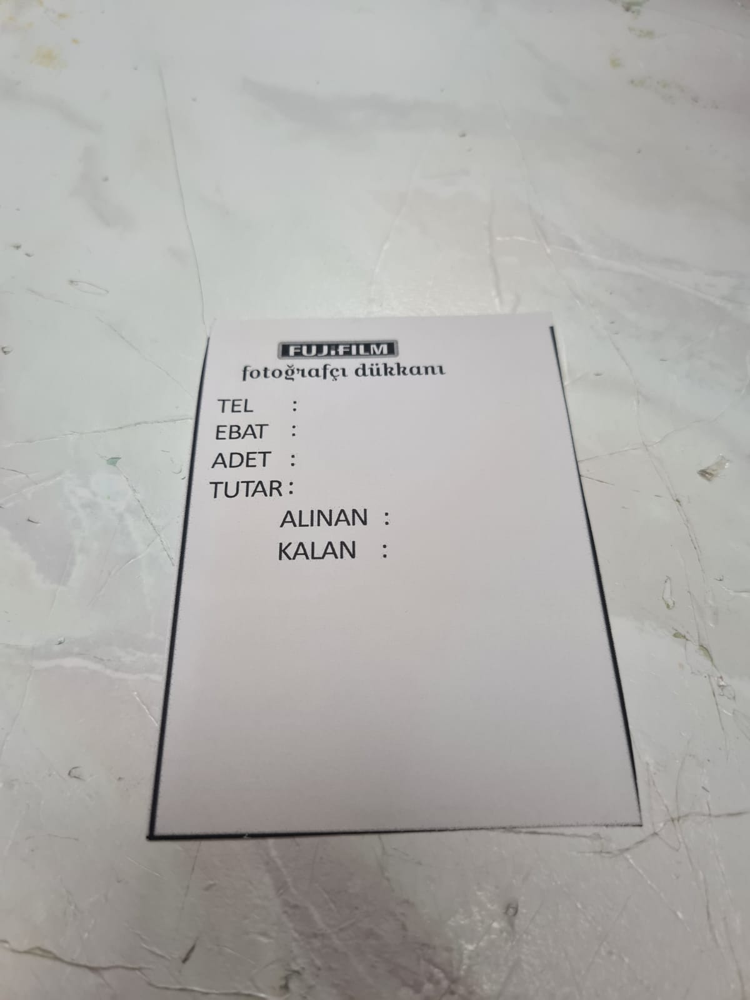
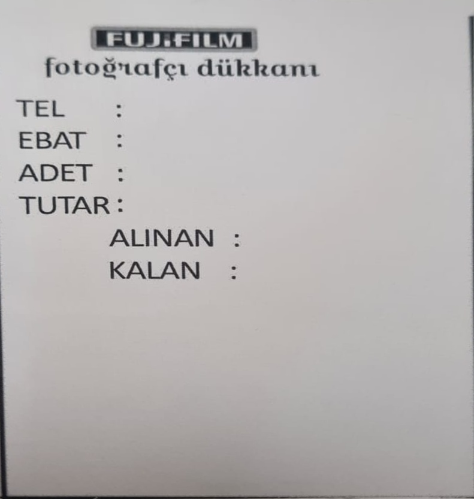

# Döküman Tarayıcı - Perspective Correction Tool

## Örnek Çıktı

| Giriş (Input) | Çıkış (Output) |
|:---:|:---:|
|  |  |
| *Telefon kamerası ile çekilmiş eğik döküman* | *Düzeltilmiş ve taranmış döküman* |

---

Fotoğraftaki dökümanları otomatik olarak tespit edip düz bir görünüme çeviren Python uygulaması.

## Özellikler
- **Otomatik arkaplan kaldırma** (rembg ile)
- **Kenar tespiti** ve kontur bulma
- **Döküman köşe noktalarını otomatik bulma**
- **Perspective düzeltme** (bakış açısı düzeltme)
- **Temiz taranmış döküman çıktısı**

## Gerekli Kütüphaneler
```bash
pip install opencv-python numpy matplotlib rembg
```

## Kullanım
1. `image.jpg` adında bir fotoğraf dosyasını proje klasörüne koyun
2. Kodu çalıştırın:
```bash
python document_scanner.py
```
3. Sonuç `scanned.jpg` olarak kaydedilir

## Dosya Yapısı
```
proje/
├── document_scanner.py
├── image.jpg          # Giriş fotoğrafı
├── scanned.jpg        # Çıkış (taranmış döküman)
├── input_example.jpg  # Örnek giriş fotoğrafı
└── output_example.jpg # Örnek çıkış fotoğrafı
```

## Nasıl Çalışır?
1. **Arkaplan Kaldırma**: rembg ile fotoğraftaki arkaplan temizlenir
2. **Kenar Tespiti**: Canny algoritması ile kenarlar bulunur
3. **Kontur Analizi**: En büyük dikdörtgen kontur tespit edilir
4. **Köşe Bulma**: Dökümanın 4 köşe noktası belirlenir
5. **Perspective Dönüşümü**: Döküman düz bir görünüme çevrilir

## Ayarlar
İhtiyacınıza göre bu değerleri değiştirebilirsiniz:
```python
edges = cv2.Canny(removed, 50, 150)        # Kenar tespiti hassasiyeti
epsilon = 0.02 * cv2.arcLength(hull, True) # Köşe bulma hassasiyeti
```

## Notlar
- **Giriş formatı**: JPG, PNG desteklenir
- **Çıkış formatı**: JPG olarak kaydedilir  
- **En iyi sonuç için**: Döküman net olmalı ve 4 köşesi görünür olmalı
- **Arkaplan**: Karmaşık arkaplanlar otomatik olarak temizlenir

## Örnek Kullanım
Telefon kamerası ile çekilmiş eğik döküman fotoğraflarını düz taranmış döküman haline getirir. Makbuz, kimlik, sertifika gibi dökümanlar için idealdir.
